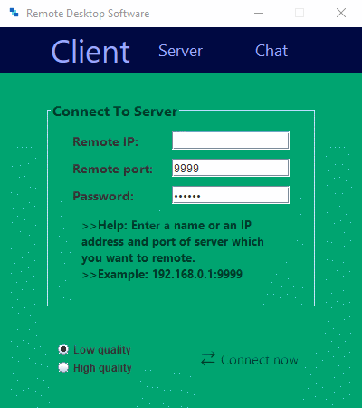
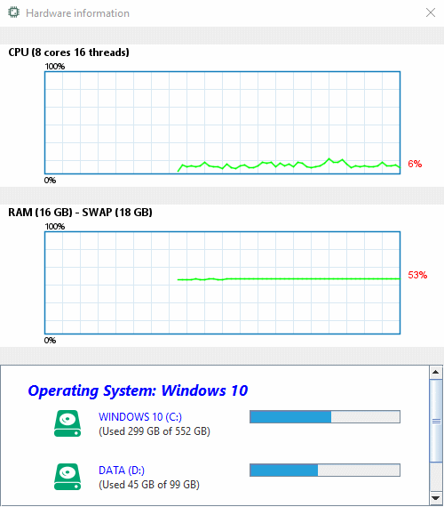
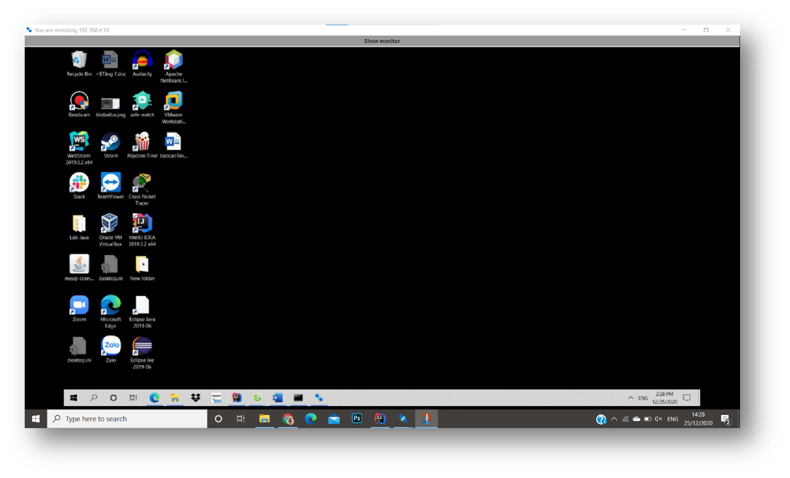

# Remote Desktop

> WRITTEN BY  Prem Chander

* Email 1: pkchander1908@gmail.com

# Tools and language

* Tools: Intellij Idea
* Java: Java RMI, Java swing, TCP, OperatingSystemMXBean

# How to run code
Run with JDK 19:
```shell 
java -jar ./out/artifacts/RemoteDesktop_jar/RemoteDesktop.jar
```

# GUI

> ### Main

<p align="center">
    
</p>


> ### Hardware information of server

<p align="center">
    
</p>

> ### Client remote server

<p align="center">
    
</p>
